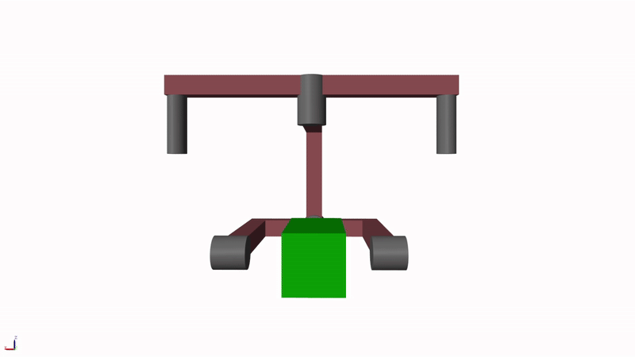

# Gimbal
Projekt __(work-in-progress)__ trójosiowego gimbala do kamery oparty na ESP32, silnikach GM5208 i enkoderach AS5048A. Stabilizuje obraz w osiach yaw, pitch i roll, eliminując drgania. Wykorzystuje SimpleFOC, czujnik BNO085 oraz algorytmy PID i kinematykę odwrotną. Lekka, modułowa konstrukcja z włókna węglowego i elementów wydrukowanych w 3D.

  

# 🎥 Trójosiowy stabilizator kamery (Gimbal)

Trójosiowy elektroniczny stabilizator obrazu, zaprojektowany w celu płynnej rejestracji ujęć wideo, eliminacji drgań oraz stabilizacji obrazu w trzech osiach (yaw, pitch, roll).
Celem projektu jest stworzenie konstrukcji możliwie prostej, taniej i dostępnej dla każdego, przy jednoczesnym zachowaniu parametrów zbliżonych do profesjonalnych stabilizatorów.

# ✨ Funkcje i założenia

- Stabilizacja obrazu w 3 osiach

- Modułowa budowa z rur węglowych i elementów 3D-print

- Ergonomiczne uchwyty (uchwyt poziomy i dwa pionowe)

- Regulowana podstawka dla różnych typów kamer (max. ~2.5 kg udźwigu)

- Obsługa zaawansowanych algorytmów stabilizacji (PID, FOC, filtracja sygnałów)

Tryby sterowania:

- Blokowanie orientacji kamery (kamera utrzymuje kierunek względem świata)

- Pan Follow – kamera podąża za obrotem w osi yaw, blokując pitch i roll

  

     
    <em>Blokada orientacji kamery</em>
  

  

     
    <em>Tryb Pan Follow</em>
  

# 💻 Oprogramowanie

Repozytorium zawiera dwa główne programy:

# Sterownik gimbala (C++)

Plik dla ESP32 (Arduino), który:

- Odczytuje orientację z czujnika BNO085 (pitch, roll, yaw).

- Oblicza kinematykę odwrotną z użyciem macierzy rotacji (Eigen).

- Wysyła kąty w postaci przetworzonej przez port szeregowy.

- Obsługuje planowane sterowanie silnikami BLDC poprzez SimpleFOC i enkodery magnetyczne (AS5048A).

- Zawiera strukturę zadań (FreeRTOS tasks) – oddzielnie dla odczytu czujnika i sterowania silnikami.

__Główne funkcje:__

- Task_BMO – odczyt danych z żyroskopu i obliczenia kinematyki.

- getInverseKinematics – obliczanie wymaganych kątów osi (roll, pitch, yaw).

- Sekcja Task_Motor_Control (zakomentowana) – planowane sterowanie silnikami metodą FOC.

# Wizualizator (Python)

  

Aplikacja w Pythonie wykorzystująca Vedo do 3D:

- Ładuje modele .obj gimbala i tworzy z nich hierarchiczną strukturę (Assembly).

- Łączy się automatycznie z ESP32 przez port szeregowy.

- Odczytuje dane kątowe (roll, pitch, yaw + kąty osi) przesyłane z mikrokontrolera.

- Aktualizuje w czasie rzeczywistym pozycję i orientację modeli 3D.

- Wyświetla okno wizualizacji z możliwością renderowania w pętli (Plotter, callback loop_func).

__Główne elementy:__

- find_esp32_port – automatyczne wykrywanie portu ESP32.

- read_serial – odczyt i parsowanie danych z mikrokontrolera.

- loop_func – aktualizacja sceny 3D w każdej klatce.

- Assembly – odwzorowanie zależności między osiami gimbala.

# 🛠️ Wykorzystane technologie

Mikrokontroler: ESP32

Silniki: GM5208-12 (BLDC, wysoki moment, niskie obroty, pusty wał do prowadzenia przewodów)

Sterownik: DRV8313 + biblioteka SimpleFOC

Enkodery: AS5048A (14-bit, SPI, absolutne pozycjonowanie)

IMU: GY-BNO085 (akcelerometr + żyroskop + magnetometr, algorytmy sensor fusion)

# 📐 Kinematyka

Opis ruchu i stabilizacji w oparciu o tablicę Denavita-Hartenberga (DH)

Obsługa kinematyki odwrotnej do wyznaczania wymaganych kątów dla silników

Macierze transformacji obliczające orientację kamery względem bazy gimbala

# ⚙️ Układ regulacji

System sterowania oparty o kaskadowe regulatory PID:

pętla położenia → wyznacza prędkość zadaną

pętla prędkości → wyznacza moment z zadanymi ograniczeniami

pętla momentu → sterowanie silnikami BLDC

Dzięki temu stabilizator zapewnia wysoką precyzję i płynność ruchu.
